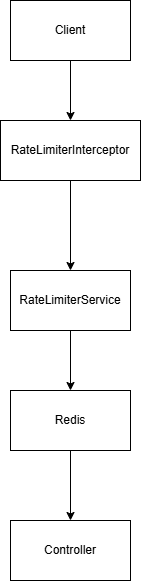

# Distributed Rate Limiter (Spring Boot + Redis)

## Overview

A distributed API rate limiting system built using Spring Boot and
Redis.

The system limits the number of requests a user can make within a time
window and protects APIs from abuse by enforcing request quotas.

Redis is used as a centralized store to ensure rate limits are enforced
consistently across multiple application instances.

------------------------------------------------------------------------

## Architecture

------------------------------------------------------------------------

## Features

-   Distributed rate limiting using Redis
-   Middleware-based request interception
-   Fixed window rate limiting algorithm
-   Automatic request counter expiration
-   API rate limit headers
-   Dockerized Redis setup

------------------------------------------------------------------------

## Tech Stack

-   Java
-   Spring Boot
-   Redis
-   Docker
-   Maven

------------------------------------------------------------------------

## How Rate Limiting Works

This system implements a Fixed Window Rate Limiting strategy.

Each request increments a counter stored in Redis.

Redis Key Structure:

rate_limit:{userId}:{minuteWindow}

Example:

rate_limit:123:28947582

Where: - 123 = user ID - 28947582 = current minute window

Redis automatically resets the counter after 60 seconds using TTL.

------------------------------------------------------------------------

## Request Flow

1.  Client sends request with X-User-Id header
2.  RateLimiterInterceptor intercepts the request
3.  RateLimiterService checks request count in Redis
4.  Redis increments the counter
5.  If limit exceeded → API returns 429 Too Many Requests

------------------------------------------------------------------------

## API Example

Request: GET /api/test

Header: X-User-Id: 123

Successful Response: 200 OK

Headers: X-RateLimit-Limit: 5 X-RateLimit-Remaining: 3

Rate Limit Exceeded: 429 Too Many Requests

------------------------------------------------------------------------

## Running the Project

1.  Start Redis

docker-compose up -d

2.  Run Spring Boot Application

mvn spring-boot:run

3.  Test API

curl -H “X-User-Id: 123” http://localhost:8080/api/test

------------------------------------------------------------------------

## Project Structure

src/main/java/com/tanish/ratelimiter

controller ApiController.java

service RateLimiterService.java

interceptor RateLimiterInterceptor.java

config WebConfig.java

model RateLimitResult.java

------------------------------------------------------------------------

## Docker Setup

Redis runs inside Docker using docker-compose.

Example docker-compose configuration:

services: redis: image: redis:7-alpine ports: - “6379:6379”

------------------------------------------------------------------------

## Possible Improvements

-   Sliding Window Rate Limiting
-   Token Bucket Algorithm
-   Redis Cluster support
-   Global rate limiting

------------------------------------------------------------------------

## Learning Outcomes

This project demonstrates:

-   Distributed system design
-   Redis-based counters
-   API middleware architecture
-   Request throttling strategies
-   Backend system design patterns
